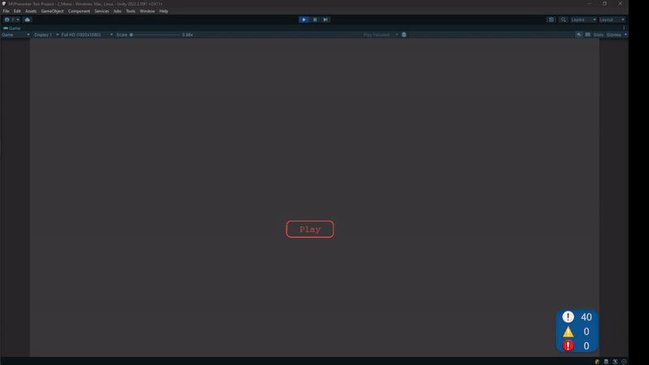

This is a test project in which I tried to implement the MVP programming pattern in the context of Unity. 

Project Architecture based on my [Zenject Template](https://github.com/xantezza/ZenjectTemplate)

For better understanding, I made this diagram

Demo

